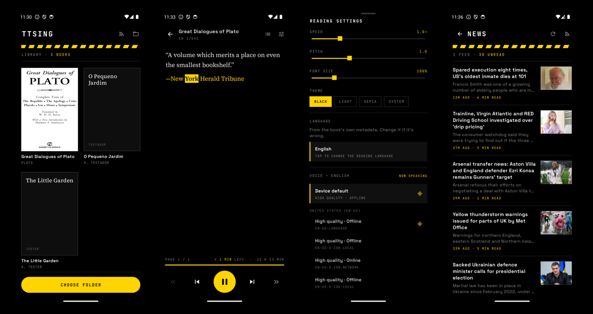

# TTSing

An Android app (Kotlin + Jetpack Compose) that reads your EPUB and PDF library aloud with
text-to-speech, highlighting the current sentence and word karaoke-style and
auto-scrolling to follow along. Built for Portuguese and English books, with
background playback and media-notification controls.



## Look

Black surfaces, and one yellow — `#FFD400` — reserved for whatever is live: the sentence
being spoken, the word inside it, how far through a book you are, unread stories, and the
play button. Nothing else is allowed to use it. Metadata is uppercase JetBrains Mono, the
interface is Space Grotesk, and the page itself is Source Serif 4; all three are bundled as
font resources, so a reader with no network still looks right. The screenshots above are the
app running, not mockups.

## Features

- **Library** — pick any folder of `.epub` and `.pdf` files (Storage Access Framework);
  covers, titles, authors and reading progress are cached so the list opens instantly.
  Progress is measured in characters, so a book full of tiny cover and title-page items
  doesn't look further along than it is.
- **Reader** — native Compose rendering of chapters (headings, paragraphs, quotes,
  inline images) laid out as **swipeable pages** (left/right), like a real e-reader, with
  a table-of-contents drawer, adjustable font size, and black / light / sepia / system
  themes — black by default, since the app around the page is black whatever the system says.
  The book reads as **one continuous run of pages**: the last page of a chapter is followed
  straight by the first page of the next, in both directions, and blank spine items are
  skipped. Chapters stay as navigation — the contents drawer, « », and ticks on the progress
  bar — never as a wall while reading.
- **KOReader-style footer** — the page of the *whole book* (`PAGE 60 / 2571`) and its
  percentage, the clock, a progress bar across the book with a tick at each chapter start,
  then the time left in the chapter and in the book. Page counts come from paginating every
  chapter exactly as the pager does, in the background, and are cached per screen size and
  font size; the font slider moves in 5% steps so each size is one cached layout.
- **Read-aloud TTS** — Android `TextToSpeech`, one utterance per sentence with a small
  look-ahead queue for smooth speech. The sentence being read turns yellow and the exact
  word inverts to black-on-yellow (`onRangeStart` word callbacks). Pages turn automatically
  to keep up with the voice.
- **Language picker** — books often declare the wrong `dc:language` (or none), which used to
  mean a German book read aloud in English with no way to fix it. The reader's settings sheet
  now lets you pick the reading language first, from the languages your TTS engine actually
  has voices for; the voice list below then follows that choice. The override is remembered
  **per book**, and the chosen voice is remembered **per language**.
- **Voice picker** — in the reader's settings sheet, voices are grouped by region
  (US / GB / …), the currently-speaking voice is marked, each shows quality and
  offline/online, and a "Device default" option returns to the engine's built-in voice.
  Speed goes up to **2.5×**.
- **Time to finish** — time left in the chapter and in the book, from the app's *measured*
  speaking speed, kept per voice and normalised to rate 1.0. It is total characters over
  total listening time (pauses included), with a three-hour memory — not an average of each
  sentence's speed, which is what used to make a 22-hour figure swing by hours between
  sentences. On screen it only rises on a real change, so a slow passage can't make it climb
  while you read forward.
- **Messy-EPUB clean-up** — footnote call-outs, note bodies and page-break markers are
  stripped before rendering, so the voice doesn't read "palavra um" for a footnote number.
  Conservative by design: a well-formed book is left untouched.
  Two more real-world defects are worked around: chapters whose bytes are UTF-8 but whose
  `<meta>` claims `iso-8859-1` (obeying the declaration turns every `’` into `’`, on screen
  *and* in the voice), and `linear="no"` spine items, which are skipped so a book doesn't
  open on a blank cover page.
- **PDFs** — read as reflowed text rather than page images, so font size, themes,
  tap-to-read and the highlighting all work as they do for an EPUB. Running headers and page
  numbers are dropped, lines are joined back into paragraphs, words hyphenated across a line
  break are mended, a sentence cut by a page or column break is rejoined, and larger type
  becomes headings. **Pictures come along too**, placed between paragraphs: each one is drawn
  from its own rectangle of the page by the platform renderer, so it looks exactly as it does
  in the PDF, and a picture that sits in the middle of a paragraph waits for that paragraph to
  end rather than splitting a sentence. Bullets, rules, small icons and page backgrounds are
  left out. Sections follow the PDF's bookmarks, or runs of ten pages when it has none. The
  cover is the first page, rendered. Scanned PDFs with no text layer say so rather than
  showing empty pages (there is no OCR).
- **Tap to start** — tap any paragraph to begin reading from there (from the sentence you
  actually touched, not the top of the page).
- **News feeds** — the RSS icon in the library opens straight onto the latest stories across
  every subscribed feed (not a feed picker first); "Manage feeds" from there is where you add
  or remove subscriptions. Reads a story the same way as a book. Articles are fetched and
  stripped down to the actual text (navigation, cookie banners, related-story rails and
  newsletter prompts are scored out), so the **whole** piece is read aloud rather than the
  truncated summary the feed ships. Feeds that inline their full text are used directly, and
  if a page can't be reached the reader falls back to the summary and says so. Photos and
  their captions are kept, downloaded once and cached on disk; lazy-loaded sources (`data-src`,
  `srcset`) are resolved, and tracking pixels, SVG icons and placeholder data URIs are filtered
  out. The article list itself shows a thumbnail per story — pulled from the feed's own media
  metadata (`media:thumbnail`, an image `enclosure`) where it offers one, or backfilled from
  the article's own lead photo the first time it's opened.
- **Anki flashcards** — long-press a sentence, tap the word you didn't know, type what it
  means, and the card goes straight into AnkiDroid. The front is the sentence with the word
  in bold plus the sentence spoken by the book's own voice; the back is your definition.
  Cards land in a `TTSing` deck, tagged with the book.
- **Background playback** — a foreground media service keeps playing with the screen off,
  with play/pause and ±sentence controls in the notification and on the lock screen.
- **Any language your engine speaks** — the reading language starts from the EPUB's
  `dc:language` and can be overridden per book (see above). Speed and pitch are global;
  the voice is saved per language.

## Project location note

This project (code + git repo) lives at `C:\Users\Pedro Lopes\AndroidStudioProjects\TTSing`.
It was moved off the original Desktop path because that path contains an invisible
`U+2800` character in the `⠀` folder, and the Android Gradle Plugin rejects non-ASCII
project paths on Windows. See `LEIA-ME.txt` left in the old Desktop folder for how to
turn that location into a junction pointing here, if you want it to appear there again.

## Requirements

- Android Studio (uses its bundled JDK 21 — `gradle.properties` pins
  `org.gradle.java.home` to `C:\Program Files\Android\Android Studio\jbr`).
- Android SDK platform 36 + build-tools 36.0.0 (already installed).
- A device or emulator running Android 8.0 (API 26) or newer, with a TTS engine and the
  Portuguese/English voice data installed (Settings → System → Languages →
  Text-to-speech). **Note:** stock emulator images often ship English only — for
  Portuguese, test on a physical phone or install the pt voice via Google TTS.
- For the flashcard feature: [AnkiDroid](https://play.google.com/store/apps/details?id=com.ichi2.anki)
  installed on the same device. The first card asks for AnkiDroid's
  `READ_WRITE_DATABASE` permission. Without AnkiDroid the rest of the app works
  normally — adding a card just reports that it isn't installed. The API comes from
  JitPack (`com.github.ankidroid:Anki-Android:api-v1.1.0`), so the first sync needs
  network access.

## Build & run

Open the folder in Android Studio and Run, or from a terminal:

```powershell
cd "C:\Users\Pedro Lopes\AndroidStudioProjects\TTSing"
.\gradlew.bat assembleDebug     # build the APK
.\gradlew.bat test              # run the JVM unit tests
```

The debug APK is written to `app\build\outputs\apk\debug\app-debug.apk`. Copies handed
off for install/testing are kept in `releases/` (git-ignored — it's build output, not
source).

## Trying it out

Sample books are in `sample-books/` (`the-little-garden.epub` in English and
`o-pequeno-jardim.epub` in Portuguese). Copy them onto the device/emulator (e.g. into
`Download/`), then in the app tap the folder icon and choose that folder. Open a book and
press play to see the sentence/word highlighting and auto-scroll.

## Architecture

```
data/book/    BookDocument — an open book of either format: sections of blocks, a TOC,
              images. EpubDocument wraps the EPUB parser; everything downstream uses this.
data/epub/    EpubParser (ZIP + OPF + nav/NCX), ChapterLoader (XHTML → blocks via Jsoup),
              BreakIterator sentence segmentation. Pure JVM, unit-tested.
data/pdf/     PdfDocument (PDFBox-Android: positioned lines, bookmarks, metadata; first-page
              cover and figures drawn via PdfRenderer), PdfReflow (lines → paragraphs and
              headings, figures placed between them, headers and page numbers dropped —
              pure JVM, unit-tested), PdfMetadata.
data/db/      Room cache of book metadata, reading position and per-layout page counts.
              Migrated, not dropped, on schema changes — reading positions live here.
data/news/    RssParser (RSS 2.0 + Atom), ArticleExtractor (readability-style scoring to pull
              the article body out of a news page), HttpFetcher, NewsRepository. Its own Room
              database (`ttsing-news.db`) with real migrations — feed subscriptions are user
              data, unlike the books cache.
data/settings DataStore: folder URI, speed, pitch, font size, theme, voice per language
              (`voice_<lang>`), language override per book (`booklang_<id>`).
data/         BookRepository — SAF folder scan, cover extraction, position persistence.
tts/          SpeakingSpeed (measured chars/second, ratio of sums, per voice),
              SpeechEngine (sentence queue + word callbacks), BookContentSource
              (sentence stream across block/chapter boundaries), ReadingService
              (foreground media service, MediaSession, notification, audio focus),
              ReadingController (binds the UI to the service).
anki/         CardDraft (sentence + target word → Anki HTML), CardAudio (its own
              TextToSpeech for synthesizeToFile, so playback is never interrupted),
              AnkiExporter (AnkiDroid AddContentApi: deck, note type, media, note).
ui/library    Folder picker + cover grid.
ui/reader     Continuous pager over a window of chapters, karaoke highlight, whole-book
              page counts (BookPages), the footer, TOC, settings sheet, flashcard sheet.
```

A reading position is `(chapterIndex, blockIndex, sentenceIndex)`; TTS utterance IDs encode
it, so every speech callback maps directly to what to highlight and where to scroll.

## Tests

Pure-JVM unit tests under `app/src/test` cover EPUB parsing (EPUB 2 NCX + EPUB 3 nav,
percent-encoded hrefs, cover detection), the XHTML→blocks conversion, Portuguese/English
sentence segmentation, end-to-end parsing of the real sample EPUBs, PDF reflow (headers
and page numbers, de-hyphenation, paragraph and page breaks, headings, where figures go
and which pictures are decoration), whole-book page
arithmetic, and the speaking-speed estimate — including a replay of sentences logged on a
device, against the old average and the new one. Run with `.\gradlew.bat test`.
